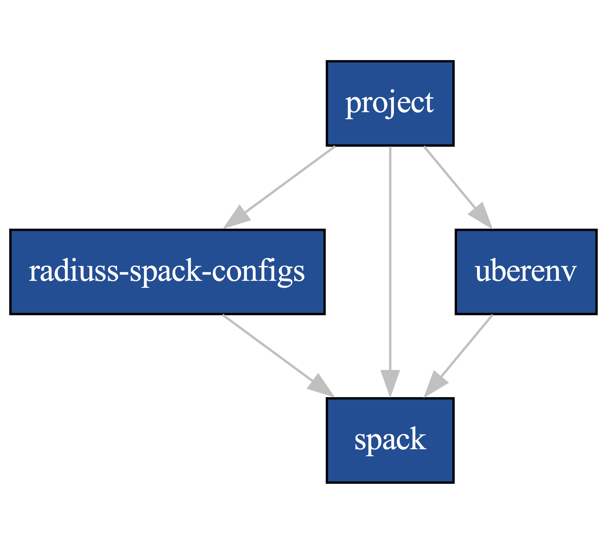

.. ##
.. ## Copyright (c) 2022-2025, Lawrence Livermore National Security, LLC and
.. ## other RADIUSS Project Developers. See the top-level COPYRIGHT file for
.. ## details.
.. ##
.. ## SPDX-License-Identifier: (MIT)
.. ##

.. _user_how_to-label:

*********
How To...
*********

This section describes how to perform various maintenance tasks when using
RADIUSS Spack Configs. This includes considerations about using it as part of
the RADIUSS Build Infrastructure and the RADIUSS Shared CI Infrastructure.

.. _update_spack_uberenv_rsc:

===============================================
Update Spack, Uberenv, or RADIUSS Spack Configs
===============================================

The RADIUSS Build Infrustructure relies on three components to work properly:
`Spack`_, `Uberenv`_ and `radiuss-spack-configs`_. The dependency scheme
between those components is as follows:

   The dependency graphs helps anticipating the impact of a change. E.g., a
   change in Spack may require changes in Ubenv, radiuss-spack-configs, and the
   project itself.

Updating radiuss-spack-configs
==============================

Be aware of incompatibilities between `Spack`_ and `radiuss-spack-configs`_
versions. In radiuss-spack-configs, we use tags to mark changes in the required
version of Spack.

Updating Spack
==============

Spack may sometimes be updated without updating the `radiuss-shared-ci`_
project version. However, there are often changes in the Spack configuration
formatting and options that will require you to update `radiuss-spack-configs`_
and `Uberenv`_.

A typical source of issues is the introduction by Spack of breaking changes in
the configuration files formatting or parsing. This has happened on a regular
basis, and it is important to analyse the release notes to spot such a risk,
and learn how to best address it.

Updating Uberenv
================

Beware that `Uberenv`_ may lag behind in terms of compatibility with `Spack`_
and updating to a newer Spack version may require modifications to Uberenv.

Shared CI jobs
==============

If you have overridden shared specs (from this repository) in your local jobs
(your project repository), you need to check for changes in the original shared
spec after the update: Is the job still there? Has the spec changed? Is there
still a need to override it?

.. _shared_ci_jobs:

===========================================================
Share jobs between projects in the Shared CI infrastructure
===========================================================

Description of the content
==========================

RADIUSS Spack Configs now also host the list of CI jobs that some RADIUSS
projects use in their CI to build and test across the same toolchains.

If you look at those files, located in ``gitlab/radiuss-jobs``, you will find
a list of YAML sections, e.g.::

  rocmcc_5_6_0_hip:
    variables:
      SPEC: "${PROJECT_CORONA_VARIANTS} +rocm amdgpu_target=gfx906 %rocmcc@5.6.0 ^hip@5.6.0 ${PROJECT_CORONA_DEPS}"
    extends: .job_on_corona

This is a CI job, ``rocmcc_5_6_0_hip``, extending the job template
``.job_on_corona`` which is in facts defined in `radiuss-shared-ci`_. You can
also see that the only thing this job appears to do is to define the ``SPEC``
variable.

`RADIUSS Shared CI`_ provides a templated CI implementation tuned for
open-source projects that need to run tests on LC GitLab. Corona is one of the
supported machine. The Shared CI infrastructure is project-agnostic: it is
expected that project provide their own jobs command (set ``JOB_CMD`` for in
their CI, for each job).

RADIUSS Spack Configs shared jobs in return assume that the job command is
parametrized by the ``SPEC`` variable, that spec being the one passed to
Uberenv and then to Spack.

.. note::
   ``PROJECT_<MACHINE>_VARIANTS/DEPS`` variables are present in all the shared
   specs. It allows projects to define a default value that will apply to all
   the specs. Projects have the freedom to add as many (local) jobs as they
   like, with or without using those variables.

Append the shared jobs to your local jobs
=========================================

Adding jobs the RADIUSS Shared CI infrustructure simply consists in including
a similarly written job files in the trigger job template::

  .build-and-test:
    stage: build-and-test
    trigger:
      include:
        - local: '.gitlab/custom-jobs-and-variables.yml'
        - project: 'radiuss/radiuss-shared-ci'
          ref: v2023.08.0
          file: '${CI_MACHINE}-pipeline.yml'
        - local: '.gitlab/jobs/${CI_MACHINE}.yml'

If you have a local job file and also want to run the RADIUSS jobs, you will
need to merge them in a specific job, and then include the generated YAML file
to the trigger job template. In Umpire for example, we do that in one job for
all four supported machines::

  generate-job-lists:
    stage: generate-job-lists
    tags: [shell, oslic]
    variables:
      RADIUSS_JOBS_PATH: "scripts/radiuss-spack-configs/gitlab/radiuss-jobs"
      LOCAL_JOBS_PATH: ".gitlab/jobs"
    script:
      - cat ${RADIUSS_JOBS_PATH}/dane.yml ${LOCAL_JOBS_PATH}/dane.yml > dane-jobs.yml
      - cat ${RADIUSS_JOBS_PATH}/lassen.yml ${LOCAL_JOBS_PATH}/lassen.yml > lassen-jobs.yml
      ...
    artifacts:
      paths:
        - dane-jobs.yml
        - lassen-jobs.yml
        ...

.. warning::
   RADIUSS jobs should be defined first in the generated file. This allows
   local jobs to overridde the shared jobs if needed. Typical scenario is a
   job needing more ressource than the others, or a specific variant. Jobs
   that are known to fail can also be allowed to fail or even deactivated
   (LINK).

The trigger job template then looks like::

  .build-and-test:
    stage: build-and-test
    trigger:
      include:
        - local: '.gitlab/custom-jobs-and-variables.yml'
        - project: 'radiuss/radiuss-shared-ci'
          ref: '${SHARED_CI_REF}'
          file: 'pipelines/${CI_MACHINE}.yml'
        - artifact: '${CI_MACHINE}-jobs.yml'
          job: 'generate-job-lists'
        ...

.. note::
   The local file ``.gitlab/subscribed-pipeline.yml`` appears like an
   appropriate location for the ``generate-job-lists`` job.

.. _allow_job_failure:

Allow failure for a spec known to fail
======================================

If a RADIUSS Shared CI pipeline comes with a spec that is known to fail for
your project, you may want to allow this spec to fail in CI.

To do so, you will have to duplicate the job in your local jobs keeping the
exact same job name and then add ``allow_failure: true`` to the job definition.

This is a job override. The flip side is that you will have to manually check
for changes in the original shared job when updating RADIUSS Spack Configs.

==========================================
Project specific variants and dependencies
==========================================

Projects often have build variants they want to test, but it does not make
sense to include them in the shared configurations since they may not apply to
other projects. Also, we want to keep the default Spack specs simple.

Example cases
=============

For example, in Umpire there is ``+fortran`` and ``+openmp`` for RAJA. Those
variants cannot be shared via the RADIUSS Shared CI project because they are
likely not implemented or relevant to other projects.

Similarly, Umpire and RAJA may require a BLT version that depends on the system
being tested. Such a requirement is not applicable to every project.

The solution
============

Variables ``PROJECT_<MACHINE>_VARIANTS`` and ``PROJECT_<MACHINE>_DEPS`` can be
set in the ``custom-variables.yml`` file to define a global variant or
dependency to apply to all the shared specs.

The flip side
=============

If a you want to build a given shared spec without certain global variants or
dependencies, you need to duplicate the original job from the
`radiuss-shared-ci`_ project and remove those variables from the spec.

.. note::
   You can keep the same job name and only the spec without global variants and
   dependencies will be built. Or you can rename it to build both specs.

.. _compare_ci_configs:

=======================================================
Compare the build and CI configurations of two projects
=======================================================

Suppose you want to be in sync in terms of Build and/or CI configuration with
another project. We summarize here the steps you should follow to make sure
both configurations are exactly the same, or find the difference between them.

Reference used to import radiuss-spack-configs
==============================================

In the ``.uberenv_config.json`` file in the top-level directory of a project,
the entry ``spack_configs_path`` should designates the `radiuss-spack-configs`_
submodule. Check the status of this submodule to look for differences.

.. note::
   The commit hash associated with a Git submodule in a project can be seen
   by running the command ``git submodule status`` in the project.

The Spack configuration can affect the external packages to use, the default
versions for a dependencies to build, etc.

Reference used by Uberenv to clone Spack
========================================

In the ``.uberenv_config.json`` file, the reference used to clone `Spack`_ can
be set with either ``spack_branch`` or ``spack_commit``.

.. note::
   It would be tedious to optain and hard to maintain coherent builds if the
   Spack versions were different between projects.

Reference used to import radiuss-shared-ci
==========================================

Shared CI jobs used to be hosted in `radiuss-shared-ci`_. This used to caused
an important maintenance overhead. Moving those jobs to RADIUSS Spack configs,
the Shared CI version in use should not impact the targets being built anymore.

Local jobs (defined by the projects)
====================================

Compare each ``.gitlab/jobs/<MACHINE>.yml`` file between the two
projects and look for:

* differences between jobs with the same name.

* overridden jobs: if a local job has the same name as a shared job it will
  override the shared job.

* jobs present only in one of the two projects.

===========================
List the Spack specs tested
===========================

`RADIUSS Shared CI`_ uses Spack specs to express the types of builds to test.
We aim at sharing those specs so that projects build with similar
configurations. However we allow projects to add extra specs to test
project-specific configurations.

Shared specs for machine ``dane``, for example, can be listed directly in
`radiuss-shared-ci`_:

.. code-block:: bash

  cd radiuss-shared-ci
  git grep SPEC gitlab/radiuss-jobs/dane.yml

Extra ``dane`` specs, specific to one project, are defined locally to the
project in ``.gitlab/jobs/dane.yml``

.. code-block:: bash

  cd <project>
  git grep SPEC .gitlab/jobs/dane.yml

===========
Use Uberenv
===========

.. code-block:: bash

  $ ./scripts/uberenv/uberenv.py

.. note::
  On LC machines, it is following the *good neighbor* policy to do your build 
  step on a compute node. Here is an example command: 
  ``srun -ppdebug -N1 --exclusive ./scripts/uberenv/uberenv.py``

Unless otherwise specified, Spack will default to a compiler. It is recommended
to specify which compiler to use by adding the compiler spec to the ``--spec=``
Uberenv command line option.

Some options
============

``--spec=`` is used to define how your project will be built. It should be the
same as a Spack spec, without the project name. For example:

* ``--spec=%clang@9.0.0``
* ``--spec=%clang@8.0.1+cuda``

The directory that will hold the Spack instance and the installations can also
be customized with ``--prefix=``. For example:

* ``--prefix=<Path to uberenv build directory (defaults to ./uberenv_libs)>``

Building dependencies can take a long time. If you already have a Spack instance
you would like to reuse (supplementing the local one managed by Uberenv), you
can do so with the ``--upstream=`` option:

* ``--upstream=<path_to_my_spack>/opt/spack ...``

===========================================
Choose a Spack reference (commit or branch)
===========================================

Uberenv needs to know which version of Spack to clone locally. The Spack
version used by a project can be found in the ``.uberenv_config.json`` file
in the top-level project directory.

In general, using the latest Spack release should be the default strategy.
But things can quickly get complicated. Among the considerations for choosing
a Spack version are:

* Need for a newer Spack feature / fix.

* Need for a newer package version, for example supporting the latest release
  of a given product.

* Coherency with other projects.

Let's consider the example of Umpire/RAJA/CHAI. Those projects work together
and have synchronized releases. They all use Uberenv for their CI.

For those projects we try to:

* Use the same Spack reference so testing behaves coherently across projects.

* Use a Spack reference as new as possible, without changing it every month
  (for now).

* Limit local patching of Spack packages.

.. note::
  A typical requirement is to update Spack to a version recent enough to
  feature the highest desired version of HIP toolchain. This is because Spack
  may mix external tools from different versions if they are not in the scope
  of supported versions defined, e.g., by the hip package. In other words, if
  the hip package defines versions up to 5.7.1 while the version 6.0.0 tools
  are defined as externals in the packages.yaml then Spack may pick up some of
  the 6.0.0 tools even when asked to build with rocm@5.7.1. An attempt to
  mitigate this issue can be found here:
  https://github.com/spack/spack/pull/41700

Limiting local patching of Spack packages
=========================================

Uberenv allows projects to duplicate any Spack package locally and patch it.
It is important to limit the amount of patching, however. Every local patch
creates a divergence between the developer / CI configuration and the one a
project gets from the Spack repo.

Typical use cases for a local package patch include:

* Test changes to the package that will be necessary for the next release.

* Fix a bug, test a tweak in a toolchain configuration (we have seen the need
  for flags, or HIP / CUDA tweaks in the past).

In any case, those local changes should be pushed to upstream Spack as soon as
possible. Typically, a project upstreams changes to its Spack package after
a project release is done. This allows the new release tag/version to be
included in the Spack package update.

Spack reference during the release process
==========================================

As mentioned above, when a projects does a release, the release has to
happen before it can be added to Spack.

Then, we want:

* To limit the use of a local patch: after a release there should be no local
  patching needed.

* To make sure we keep testing our code as close as possible to the user
  configuration: only the latest Spack package has the logic to build the
  latest release. **(Most) users will want that.**

For a project, that means we will have to update the Spack reference for
Uberenv as soon as the Spack package has been updated.

.. note::
   Upstream of the release, we might want to test the upcoming Spack package
   changes in spack@develop. In other words, we could anticipate the creation
   of a pull request in Spack and use it as a reference in Uberenv. However, it
   is not advised to create the release with this setting, because Uberenv now
   points to a PR in Spack that may disappear in the future.

In a nutshell
=============

The chosen Spack reference used in Uberenv should evolve in time as follows:

* After a project release, when the upstream Spack package gets updated, and
  Uberenv should point to the corresponding Spack merge commit.

* Then, when a new Spack release comes out, it will have our latest changes and
  should be used as a reference.

* Approaching a new release, Uberenv should point to the latest Spack release,
  but we might want to anticipate some testing with spack@develop, without
  merging that change.

.. _RADIUSS Shared CI: https://radiuss-shared-ci.readthedocs.io/en/latest/index.html
.. _radiuss-spack-configs: https://github.com/LLNL/radiuss-spack-configs
.. _radiuss-shared-ci: https://github.com/LLNL/radiuss-shared-ci
.. _Uberenv: https://github.com/LLNL/uberenv
.. _Spack: https://github.com/spack/spack
