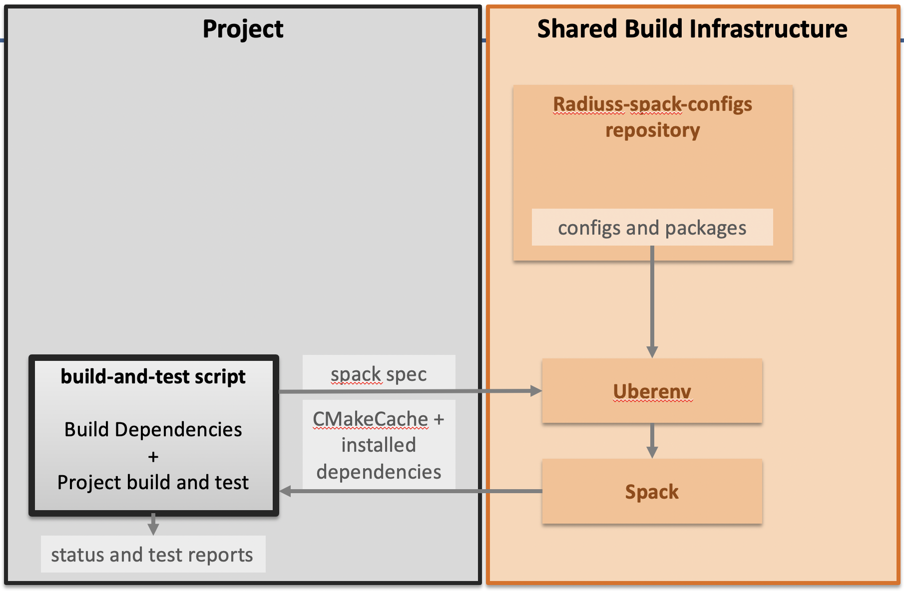

.. ##
.. ## Copyright (c) 2022-2025, Lawrence Livermore National Security, LLC and
.. ## other RADIUSS Project Developers. See the top-level COPYRIGHT file for
.. ## details.
.. ##
.. ## SPDX-License-Identifier: (MIT)
.. ##

.. _User Guide:

##########
User Guide
##########

The RADIUSS Spack Configs projects provides a *coherent set of Spack
configuration files* targetting Livermore Computing systems. The goal is to
enable any Spack user to quickly reproduce the exact same configuration RADIUSS
projects are vetted with.

RADIUSS Spack Configs can be used to provide the `RADIUSS Shared CI`_
infrastructure with a build and test process and a proposed list of Spack
specs. In practice, sharing that list of Specs helps Umpire, RAJA, CHAI,
Caliper and other projects to ensure, in their CI, that they keep running
correctly with toolchains of interest.

   RADIUSS Spack Configs provides Spack configuration files tuned for Livermore
   Computing (LC) machines. It is also possible to create a local set of Spack
   packages. Uberenv can leverage these shared configuration to ease the use of
   Spack on LC systems. Using the CachedCMakePackages allows us to only install
   a project dependencies and generate a CMakeCache file to proceed with the
   project build manually.

The figure illustrates the setup of a project using the RADIUSS Spack Configs,
Uberenv and Spack as a build infrastructure.

Both `RADIUSS Spack Configs`_ and `Uberenv`_ are to be set as submodules.

We will describe how to set up RADIUSS Spack Configs to build your project and
its dependencies with Spack. We identified two key steps:

.. toctree::
   :maxdepth: 2

   use_spack
   build_and_test

We also provide "How To" sections to perform various usage tasks.

.. toctree::
   :maxdepth: 2

   how_to

.. _RADIUSS Shared CI: https://radiuss-shared-ci.readthedocs.io/en/latest/index.html
.. _RADIUSS Spack Configs: https://github.com/LLNL/radiuss-spack-configs
.. _Uberenv: <https://github.com/LLNL/uberenv>
.. _Spack: <https://github.com/Spack/Spack>
